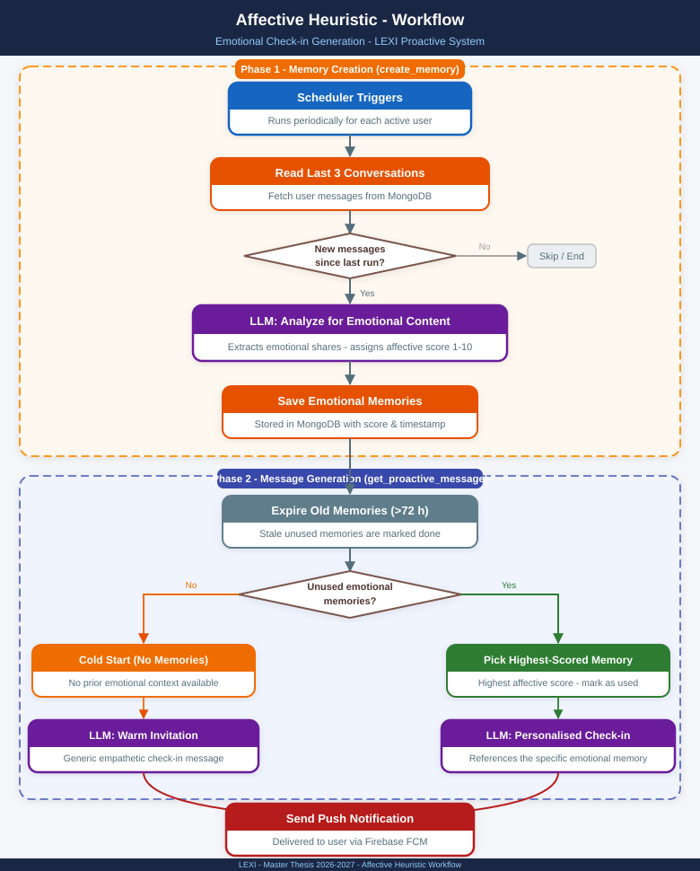
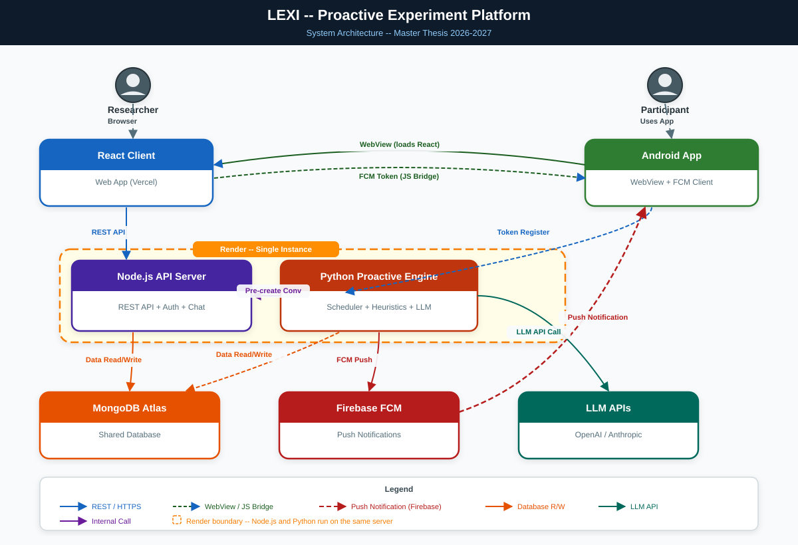

# Lexi — Proactive Conversational Agent

**Master's thesis research platform · 2026–2027**

A full-stack system for studying **AI-initiated conversations**. It decides *when* to contact a participant,
chooses *what kind of memory* the message should draw on, sends a push notification to their phone,
and opens a chat that already begins with that message. Researchers configure and monitor all of it from a dashboard.

> Built on [Lexi](https://github.com/Tomer-Lavan/Lexi) by Tomer Lavan. The proactive engine, the Android app, the deployment setup
> and the related dashboard, server and client changes are thesis work — the exact list is in [`docs/UPSTREAM_DELTA.md`](docs/UPSTREAM_DELTA.md).

> **Status: research prototype.** A full review is in [`docs/REVIEW.md`](docs/REVIEW.md). Read its section 0 and section 1
> before collecting participant data.

---

## The idea

Each notification cycle, for each participant, the engine draws **one** heuristic according to the probabilities the researcher set for the experiment:

| Heuristic | Looks for | Message |
|---|---|---|
| **Affective** | an emotional moment the participant shared (recent) | a warm check-in that refers to it |
| **Temporal** | an event they mentioned that is 6–24 h away | a timely question about it |
| **Behavioural gap** | an intention stated 24–48 h ago with no sign of follow-through | a gentle "did you end up …?" |
| **Generic** | nothing | a neutral invitation to chat (control) |
| *Reactive* | — | nothing is sent (control) |

If a drawn heuristic has no usable memory it sends a cold-start message instead, and the log records that (`was_fallback`).
Weights, the persona prompts, the LLM (OpenAI or Anthropic), schedule (exact times, random windows, or LLM-planned times)
and language are all edited live in the dashboard.



## How it fits together



| Part | Folder | Tech |
|---|---|---|
| Proactive engine | [`logic-python/`](logic-python) | Python 3.12, APScheduler, Firebase Admin |
| API | [`Lexi/server/`](Lexi/server) | Node 18, Express, TypeScript, Mongoose |
| Web app + admin dashboard | [`Lexi/client/`](Lexi/client) | React, TypeScript, Material UI |
| Participant app | [`android-app/`](android-app) | Kotlin, WebView, Firebase Cloud Messaging |
| Deploy scripts | [`scripts/`](scripts) | Render build/start |
| Database | MongoDB Atlas | shared by API and engine |

Step-by-step behaviour of one cycle, the data contracts and the onboarding flow: [`docs/ARCHITECTURE.md`](docs/ARCHITECTURE.md).

## Quick start

```bash
# 1. Configure (each component has an .env.example)
cp Lexi/server/.env.example  Lexi/server/.env
cp Lexi/client/.env.example  Lexi/client/.env
cp logic-python/.env.example logic-python/.env      # then fill in the values

# 2. API                          3. Web app
cd Lexi/server                    cd Lexi/client
npm install && npm run dev        npm install && npm start

# 4. Proactive engine — run one cycle by hand
cd logic-python
pip install -r requirements.txt
python run_cycle.py               # or `python scheduler.py` for the real timers
```

For the Android app open [`android-app/`](android-app) in Android Studio, add your `google-services.json`, and set `SERVER_URL` and
`FRONTEND_BASE_URL` in `app/build.gradle.kts`. Full instructions, environment variables, deployment and a runbook: [`docs/OPERATIONS.md`](docs/OPERATIONS.md).

> Point `LEXI_SERVER_URL` in `logic-python/.env` at your **local** API while testing — its default is the production server.

## Documentation

| Document | For |
|---|---|
| [`docs/ARCHITECTURE.md`](docs/ARCHITECTURE.md) | how the system works |
| [`docs/DATA_AND_ANALYSIS.md`](docs/DATA_AND_ANALYSIS.md) | log schema, queries, analysis pitfalls |
| [`docs/OPERATIONS.md`](docs/OPERATIONS.md) | setup, deployment, runbook |
| [`docs/REVIEW.md`](docs/REVIEW.md) | known problems and what to fix first |
| [`docs/UPSTREAM_DELTA.md`](docs/UPSTREAM_DELTA.md) | which code is Lexi's and which is the thesis's |
| [`docs/archive/`](docs/archive) | historical implementation notes |

## Deployment (current)

| Component | Platform |
|---|---|
| Web app | Vercel |
| API + Python scheduler (one instance) | Render |
| Database | MongoDB Atlas |
| Push notifications | Firebase Cloud Messaging |

## Attribution & license

**Lexi web platform** — original work by [Tomer Lavan](https://github.com/Tomer-Lavan/Lexi); see [`Lexi/license`](Lexi/license).
**Thesis extensions** — proactive notification engine, heuristic memory system, experiment controls, Android app and deployment: Itai Kohn, Master's Thesis 2026–2027.
